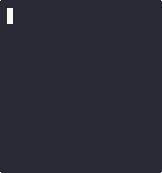

# Higgaion Core Cryptography & Proofs

[](https://github.com/trodjr/higgaion-core-crypto/actions/workflows/coq-build.yml)
[](https://codecov.io/gh/trodjr/higgaion-core-crypto)

[](https://coq.inria.fr)
[](#quad-tier-formal-verification)
[](https://pkg.go.dev/github.com/trodjr/higgaion-core-crypto/go)
[](python/)
[](rust/)
[](https://bestpractices.coreinfrastructure.org/projects/63)

This repository contains the core post-quantum cryptographic primitives (ML-DSA OpenSSL wrappers) and the **101 Gallina (Coq) Mechanized Proofs** that verify the safety invariants of the Higgaion PQC Migration Engine.

🌐 **Official Website:** [higgaion.io](https://higgaion.io)

## Asciinema Demo: Zero-Downtime Migration


## Disjunctive Verification & Erasure-Before-WAL Whitepaper
We have published a comprehensive architectural whitepaper detailing the Disjunctive (OR-Mode) Hybrid Verification protocols and the inverted "Erasure-Before-WAL" journaling sequence. 

📄 **[Read the Academic Whitepaper (PDF)](higgaion_ACADEMIC_PAPER.pdf)**

The whitepaper explains:
1. Why standard database WALs fail during classical key destruction (SNDL vulnerability).
2. How to achieve uncoordinated, rolling zero-downtime upgrades across sharded, multi-node infrastructure.
3. The methodology behind the adversarial quad-tier formal verification pipeline.

## Enterprise Gateway (Zero-Trust Edge Proxy)
Alongside the core engine, this repository also hosts the formal assurances for the **Enterprise Gateway**—a high-assurance sidecar proxy designed to bridge existing Identity Providers (IdP) to air-gapped Hardware Security Modules without exposing internal infrastructure.

### Proxy Behavior Under Adversarial Load
The proxy enforces rigorous domain-separation tags on incoming signatures.

**Seamless PQC Orchestration**  
The Gateway proxy authenticates the caller via OIDC, validates the signature cryptographically, and seamlessly routes the post-quantum payload request to the enterprise HSM, abstracting away the protocol complexity.


**Strict Isolation Defense**  
Every route is guarded by Coq-verified `StrictIsolation` invariants. Unauthorized scans and mathematically spoofed JWTs are instantly dropped by the Sidecar proxy at the edge, never reaching the core node logic.


The Gateway state machine operates under its own formally verified invariants located in:
- `coq/Gateway.v` (Mechanized Gallina Proofs)
- `tla/Gateway.tla` (Temporal Logic of Actions specifications)

## Quad-Tier Formal Verification
The proofs in `coq/` compile with **zero admitted lemmas**. They mechanically verify:
- 4-State Transition Matrix (CLASSICAL → HYBRID → FINALIZING → PQC_ONLY)
- Disjunctive (OR-Mode) Dual Signatures
- Adversarial Crash Recovery + Erasure-Before-WAL invariants

## Quick Start & Build
```bash
# Clone + build everything
git clone https://github.com/trodjr/higgaion-core-crypto.git
cd higgaion-core-crypto

make          # builds C core + runs Coq proofs
make test     # runs the 26 cryptographic roundtrip tests
make coverage # runs coverage suite (requires lcov/gcov)
make clean
```

## Language Bindings (Golang)

Higgaion Core Crypto provides a mathematically safe, idiomatic Go wrapper around the core C primitives using `cgo`. 

```go
import "github.com/trodjr/higgaion-core-crypto/go"

// Generate memory-safe ML-DSA-87 PQC keys
priv, pub, err := higgaion.GenerateKeypair("ML-DSA-87")
if err != nil {
	panic(err)
}
defer priv.Free() // Prevents OpenSSL pointer leaks

// Sign over a network domain boundary
sig, err := priv.Sign(message, "gateway-production-zone")

// Validate signature cryptographically
valid := pub.Verify(message, sig, "gateway-production-zone")
```

Execute the wrapper tests via the CLI:
```bash
make test-go
```

## Language Bindings (Python 3)

Higgaion Core Crypto provides a mathematically safe, idiomatic Python 3 FFI wrapper using standard `ctypes` over the dynamically compiled `libpqc_crypto.so` core.

```python
from higgaion import GenerateKeypair

# Generate memory-safe ML-DSA-87 PQC keys. OpenSSL pointers bind to Python Garbage Collection.
priv, pub = GenerateKeypair("ML-DSA-87")

# Sign and verify over a network domain boundary natively
sig = priv.sign(message, "gateway-production-zone")
valid = pub.verify(message, sig, "gateway-production-zone")
```

Execute the Python wrapper CI validations:
```bash
make test-python
```

## Language Bindings (Rust)

Higgaion Core Crypto securely exports native C OpenSSL bounds into canonical Rust types. Memory management is explicitly bounded via the `Drop` trait directly hooked to `higgaion_key_free()`, completely abstracting raw FFI `unsafe` executions from developers.

```rust
use higgaion_core_crypto::generate_keypair;

// FFI generation safely bridged into canonical Rust scope
let (priv_key, pub_key) = generate_keypair("ML-DSA-87").unwrap();

// Sign and verify across the zero-trust boundary, safe from leakages 
let sig = priv_key.sign(b"authorization_payload", "gateway-production-zone").unwrap();
let is_valid = pub_key.verify(b"authorization_payload", &sig, "gateway-production-zone");
```

Execute the isolated Rust `cargo` validations:
```bash
make test-rust
```

## AI Methodology Disclosure (Radical Transparency)
This project embraces *radical transparency* regarding its development methodology. The C implementations, cryptographic state machine, and specifically the 101 Gallina formal proofs were engineered using state-of-the-art AI pair-programming models under the strict architectural guidance of a human protocol expert. 

We don't ask you to trust the AI's output, nor do we ask you to trust human ego. We ask you to trust the Coq compiler's AST evaluator. If there is a single hallucination, memory leak, or unproven lemma, the 101 proofs fail to compile. Mathematical truth supersedes all origins.

## Licensing

- **Code & Coq proofs** (, , etc.): Proprietary License (see [LICENSE](LICENSE))
- **Academic Whitepaper** (`higgaion_ACADEMIC_PAPER.pdf`): Creative Commons Attribution 4.0 (CC BY 4.0) — see footer on page 1
- **Patent-protected core**: U.S. Provisional Patent Application No. 64/000,480 (state machine, Erasure-Before-WAL, disjunctive protocol). Full enterprise SDK available via commercial license — contact inquiries@higgaion.io
